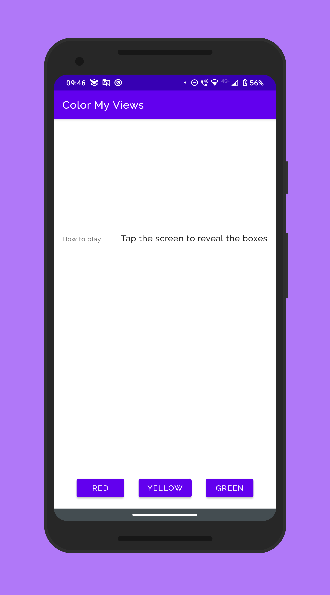
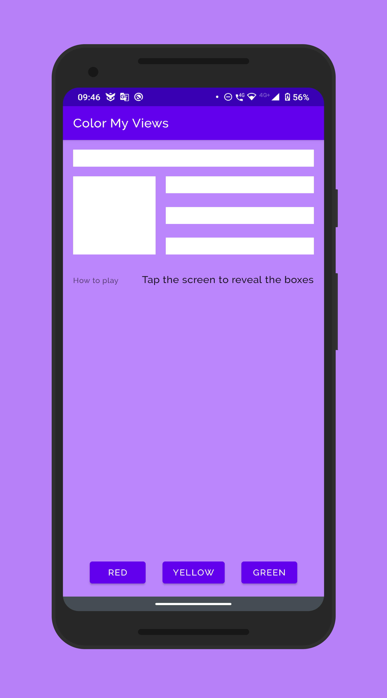
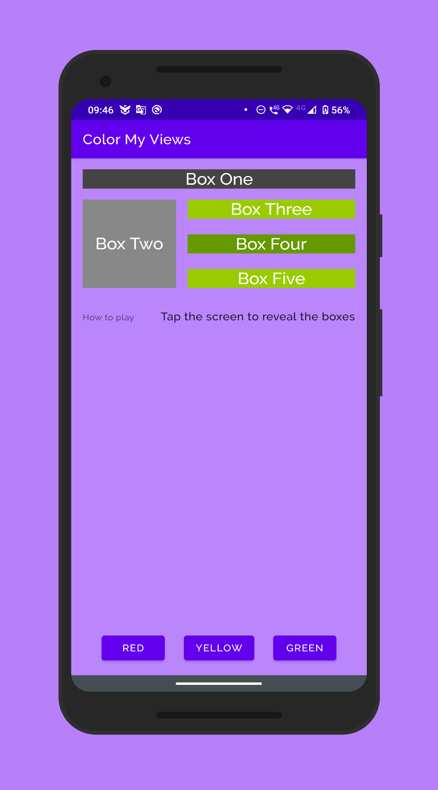
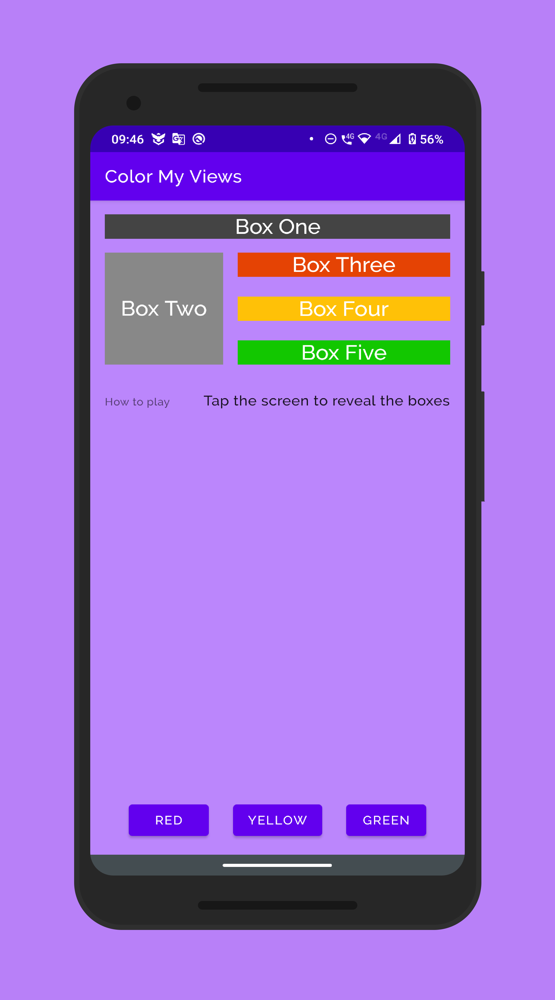

# Color My Views

## Project Overview

Color my views is a toy app [applying](https://developer.android.com/training/constraint-layout) ConstraintLayout [concepts](https://developer.android.com/reference/androidx/constraintlayout/widget/ConstraintLayout).

## Concepts covered

- [Custom styles](https://developer.android.com/guide/topics/ui/look-and-feel/themes)
- [Custom fonts using Downloadable Fonts](https://developer.android.com/guide/topics/ui/look-and-feel/downloadable-fonts)
- [ConstraintLayout chains](https://developer.android.com/reference/androidx/constraintlayout/widget/ConstraintLayout#Chains)
- [ConstraintLayout ratio](https://developer.android.com/reference/androidx/constraintlayout/widget/ConstraintLayout#ratio)
- [ConstraintLayout positioning and bias](https://developer.android.com/reference/androidx/constraintlayout/widget/ConstraintLayout#CenteringPositioning)
- [ConstraintLayout relative positioning using baseline](https://developer.android.com/reference/androidx/constraintlayout/widget/ConstraintLayout#RelativePositioning)

## Showcase

    
    
    
    

## Live Running

